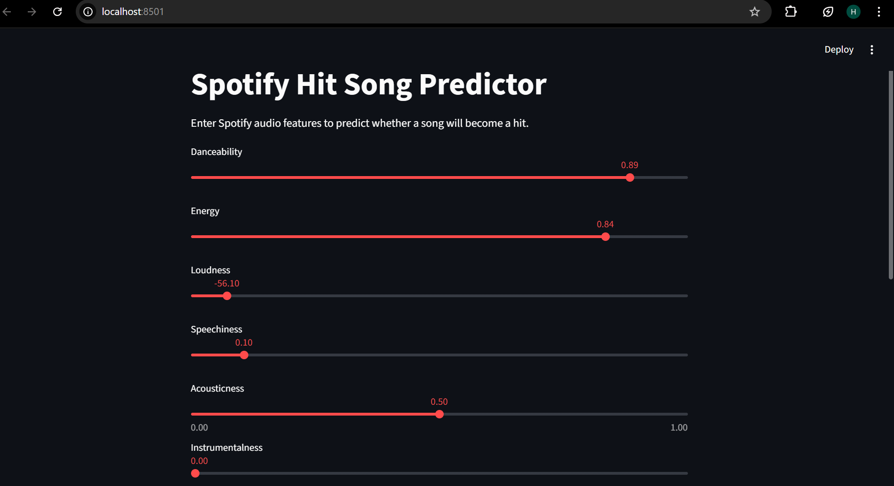

# Spotify Hit Song Prediction

This project uses machine learning to predict whether a Spotify track will become a hit based on its audio features.

## Features
- Exploratory Data Analysis on Spotify dataset
- Machine learning models: Logistic Regression, Random Forest, XGBoost
- Model comparison and evaluation
- Interactive web application using Streamlit

## Tech Stack
Python, Pandas, Scikit-learn, XGBoost, Streamlit

## Model Performance
Random Forest achieved the highest accuracy of ~98%.

## Web Application
Users can input Spotify audio features and predict whether a song is likely to become a hit.
## Streamlit Application

